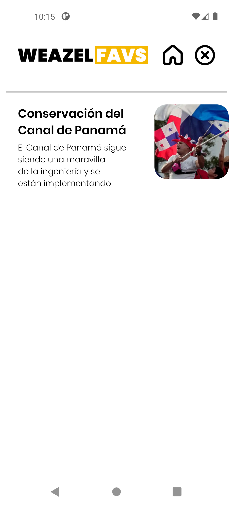

# University team project - News application

Develop a mobile application in Android Studio using Java, which consumes news from a web service and displays the results in a user interface. Additionally, saving news to a favorites list using an SQLite database should be allowed.

##### Project Requirements:
##### 1. Main Activity:
- Create a main activity where the news obtained from a web service is displayed in a RecyclerView.
- Use the Volley library to query the web service.
- Show an attractive and responsive design for the news list.

##### 2. Query to the Web Service:
- Make a query to a news web service.
- Parse the response and display the results in the RecyclerView.
- Each RecyclerView item must show at least the title and a brief description of the news as well as a representative image.

##### 3. News Detail:
- When clicking on a news item in the RecyclerView, a new activity should open showing the full content of the news item. The search for that news must be carried out in another web service provided.
- This screen must include the title, complete content and any other relevant information (image, author, date, etc.).

##### 4. Favorites:
- Implement optional functionality so that users can save news to a favorites list.
- Save the ID of the favorite news in a SQLite table.
- Include an option in the user interface to access the favorites list and view saved news.

##### Technical requirements:
- Use Android Studio as a development environment.
- Develop the application in Java language.
- Use Volley to make HTTP queries to the web service.
- Use Glide to display images based on a url.
- Implement an SQLite database to manage favorites.

## Main activity
Haciendo peticion a la API para obtener la informacion de las noticias

  

## By accessing one and giving it a favorite

  

## When click to the Favorite section

  

## By clicking the exit button

  

